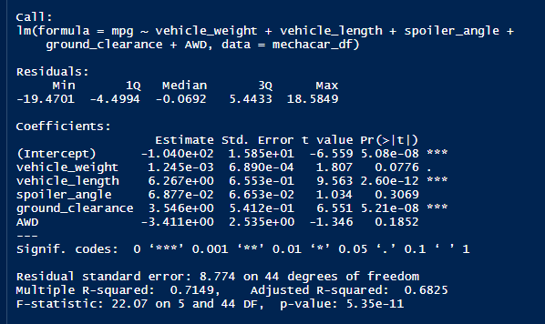
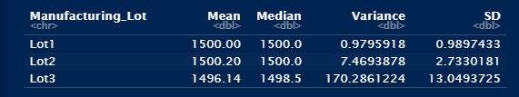
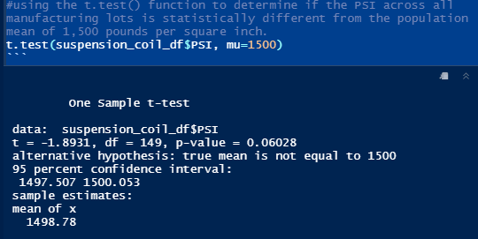
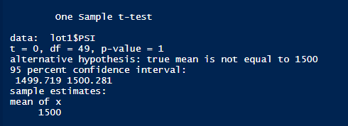
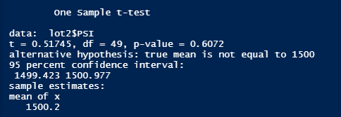
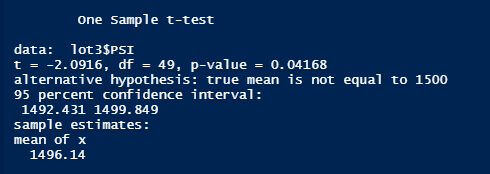

# Statistical Analysis using R for MechaCar project
## Purpose:
Using R for the AutosRUs company MechaCar project, perform multiple linear regression analysis, collect summary statistics, run t-Tests, design a statistical study against other manufacturers. 

### Tools:
In this project I'm using two csv files, R language and RStudio application.

# Analysis:

## Linear Regression to Predict MPG

The above figure shows the linear regression to predict MPG. Below is the summary of the output from the linear regression and addresses to the following questions:

1. Which variables/coefficients provided a non-random amount of variance to the mpg values in the dataset?

To determine which variables provide a significant contribution to the linear model, we must look at the individual variable p-values. In the summary output, each Pr(>|t|) value represents the probability that each coefficient contributes a random amount of variance to the linear model. Assumed significance level of p-value is 0.05% which is statistically unlikely to provide random amounts of variance to the linear model. In other words those variables have a significant impact on MPG. As seen in the figure above vehicle length p-value = 2.60x10-12, intercept p-value = 5.08x10-8 and ground clearance p-value = 5.21x10-8 provided a non-random amounth of variance to the MPG values in the dataset. It may mean that there are other variables that can help explain the variability of the dependent variable that have not been included in this model. Depending on the dataset and desired performance of the model, we may want to change the independent variables and/or transform them and then re-evaluate the coefficients and significance.

2. Is the slope of the linear model considered to be zero? Why or why not?

The p-value of linear regression analysis is 5.35 x 10-11, which is much smaller than assumed significance level of 0.05%. Therefore, we can state that there is sufficient evidence to reject null hypothesis, which means that the slope of linear model is not zero and that there is significant linear relatioship between MPG of MechaCar prototype and variables.

3. Does this linear model predict mpg of MechaCar prototypes effectively? Why or why not?

To quantify how well a linear model can be used to predict future observations, linear regression functions calculates an r-squared value which the above summary shows that it is 0.7149 for MechaCar. The r-squared (r2) value is also known as the coefficient of determination and represents how well the regression model approximates real-world data points. In most cases, the r-squared value will range between 0 and 1 and can be used as a probability metric to determine the likelihood that future data points will fit the linear model. Multiple R-squared value of 0.7149 tells me that this linear model effectively predicts MPG of MechaCar prototypes.

## Summary Statistics on Suspension Coils
 Below is the summary stats on suspension coils using screenshots from the total_summary and lot_summary dataframes, and addresses to the following question:

1. The design specifications for the MechaCar suspension coils dictate that the variance of the suspension coils must not exceed 100 pounds per square inch. Does the current manufacturing data meet this design specification for all manufacturing lots in total and each lot individually? Why or why not?

#### All manufacturing lots in total:

The above figure shows all manufacting lots in total. Variance means how far a set of numbers is from the average. Variance value is 62.2935 as seen in the image. According to the table in the image 'Variance' of the suspension coils does not exceed the 100 pounds per square inch (PSI) which means the current manufacturing data meets the design specification for all manufacturing lots in total.

#### Each lot individually:

The above figure shows each lot individually. Variance means how far a set of numbers is from the average. According to the table in the image 'Variance' of the suspension coils in lot 1 and 2 are within the requirements and not exceeding the 100 PSI. Lot 1: 0.9795 and lot 2: 7.4693 PSI. Therefore lot 1 and 2 meet the design specification. Lot 3 has 170.2861 Variance and does exceed the 100 pounds per square inch (PSI) which means the current manufacturing data does not meet the design specification.

## T-Tests on Suspension Coils
Below is the summary interpretation and findings for the t-test results and screenshots of the t-test to support the summary. t-tests are run to determine if the manufacturing lots are statistically different from the mean population.

t-test is one of the most basic and popular statistical tests in the world. In statistics, we use a t-test to compare the mean of one dataset to another under a few assumptions. There are two main forms of the t-test that are used: the one-sample t-test and the two-sample t-test. Here I use one sample t-test which determines whether there is a statistical difference between the means (1500 PSI) of a suspension coil dataset and a hypothesized, potential population dataset. In other words, a one-sample t-test is used to test the following hypotheses:
-	H0 : There is no statistical difference between the observed suspension coil mean and its presumed population mean 1500 PSI.
-	Ha : There is a statistical difference between the observed suspension coil mean and its presumed population mean 1500 PSI.

p-value determines if there is a statistical difference between the observed suspencion coil mean and presumed population mean. Assumed significance level of p-value is 0.05%. One sample t-test for all lots as seen in the image above show p-value = 0.06028.

One sample t-test for each lot as seen  in the images above show p-values for 
lot 1 = 1, lot 2 = 0.6272, lot 3 = 0.041
As you can see p-values for lot 1 and 2 are above 0.05 and this tells me that there is not enough evidence and fail to reject the null hypothesis. lot 3 is below the 0.05 but it is still not enough evidence to reject the null hypothesis.

## Study Design: MechaCar vs Competition.

This project is a statistical study to compare performance of the MechaCar vehicles against performance of vehicles from other manufacturers.  A statistical study that can quantify how the MechaCar performs against the competition. 

1. What metric or metrics are you going to test?

In my study design, I can say that the metrics would be of interest to a consumer is horse power because hp is a common performance metrics and also engine size and fuel efficiency are very important metrics for tests. HP data can be easily collected from large number of vehicles and tested weather or not hp of MechaCar statistically different from the collection of other comparable vehicles.

2. What is the null hypothesis or alternative hypothesis?

Data analytics using null and alternative hypothesis testing is one of the core statistical concepts. In an ideal world, we would be able to definitively decide if null hypothesis or alternative hypothesis was true by collecting all possible measurements or data points. But since this is often impossible, we must approximate truth using a subset of data. For example if we were to represent hypotheses using mathematical symbols, it would be expressed as:
H0 : PH = 0.5
Ha : PH ≠ 0.5
Where PH represents the probability of flipping heads. Null hypothesis could be that the likelihood of flipping heads is the same as flipping tails. Alternative hypothesis might be that the likelihood of flipping heads is not the same as flipping tails. There is no statistical difference between MechaCar horse power and hp of all other comparable vehicles.

3. What statistical test would you use to test the hypothesis? And why?

One-sample t-test can be used. The reason is to check if sample data is representative of the underlying population, a quantitative evidence, statistical test t-test is used. The t.test()function produces test statistic "t" along with p-value, which is used to evaluate null hypothesis.Therefore, I would use the p-value to provide quantitative evidence as to which of hypotheses are true. To determine which hypothesis is most likely to be true, the p-value is compared against a significance level. In most cases, a significance level of 0.05 is sufficient.

4. What data is needed to run the statistical test?

I would need continuous horse power data points from vehicles as well as continuous data points from the MechaCar vehicles. For Anova, chi-squared test types I would need categorical hp data points. For simple and multiple linear regression test continuous hp data points needed. As for the one-sample t-test sample or population hp data points needed.
